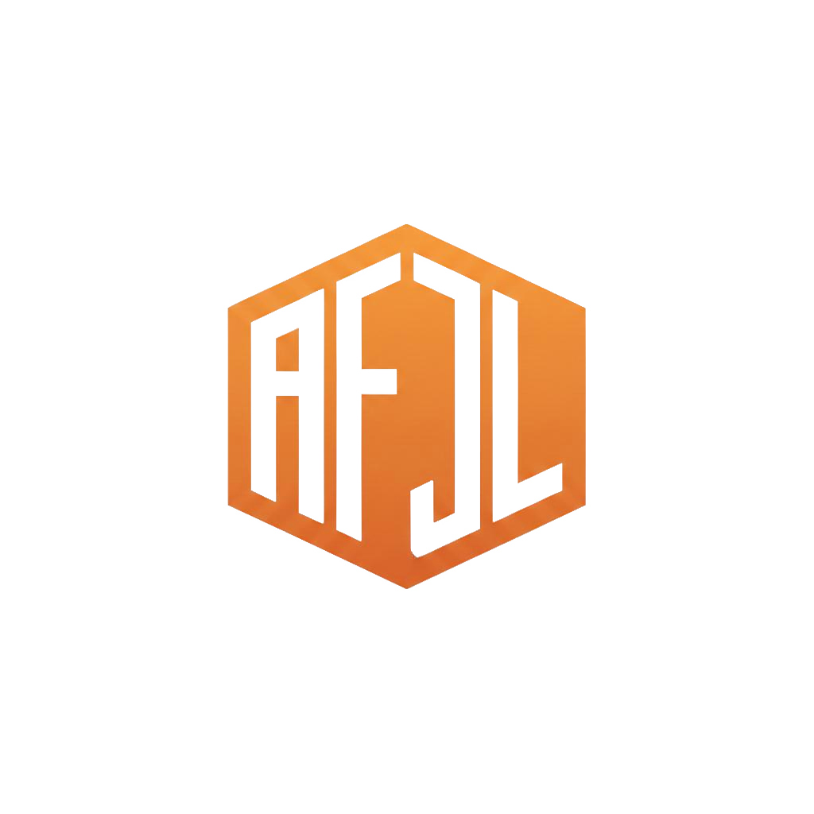

<div align="center">
  
  <h1>AI-First JS Layer (AFJL)</h1>
  <p><strong>AI as a native primitive for JavaScript.</strong></p>
</div>

AFJL is a lightweight, type-safe runtime that brings AI capabilities directly into your JavaScript/TypeScript application logic. It enables decision-driven logic, self-adapting agents, and semantic security without heavy backend dependencies.

[](https://www.npmjs.com/package/afjl)
[](https://opensource.org/licenses/MIT)

## Features

- **🧠 Declarative AI Logic**: Use `ai.select` and `ai.model` instead of hardcoded `if/else`.
- **🛡️ Adaptive Security**: Capability-based security with `ai.ref` to protect sensitive context.
- **⚡ Client-First Runtime**: optimized for Browsers (WebGPU/WASM) with graceful degradation.
- **🔌 Progressive Enhancement**: Works everywhere, scales with hardware availability.
- **🔍 Full Observability**: Built-in memory, learning, and decision explainability.

## Installation

```bash
npm install afjl
# or
yarn add afjl
# or
pnpm add afjl
```

## Quick Start

```typescript
import { ai } from 'afjl';

// 1. Define an agent
const agent = ai.agent({ model: 'gpt-mini', memory: 'session' });

// 2. Make a context-aware decision
const decision = await ai.select({
  variants: {
    compact: 'Render compact view',
    detailed: 'Render detailed view'
  },
  context: {
    mobile: window.innerWidth < 600,
    battery: await navigator.getBattery()
  },
  goal: 'Maximize information density without clutter'
});

console.log(`Selected: ${decision.result}`);
console.log(`Confidence: ${decision.confidence}`);
console.log(`Reasoning: ${decision.reasoning}`);

// 3. Learn from user interaction
ai.observe('click', (event) => {
  agent.learn({ action: decision.result, outcome: 'positive' });
});
```

## Core Primitives

- **`ai.model(id, opts)`**: Manage local or remote models.
- **`ai.agent(config)`**: Create autonomous agents with memory and tools.
- **`ai.memory(kind)`**: `session` | `long-term` | `vector` storage.
- **`ai.select(config)`**: Probabilistic decision router.
- **`ai.ref(id)`**: Secure semantic references.
- **`ai.capability(id)`**: Managed access rights.

## Ecosystem

- **`afjl`**: Core runtime (this package).
- **`@afjl/lint`**: ESLint plugin for context safety.
- **`@afjl/react`**: (Coming Soon) React hooks and components.

## Documentation

Full documentation is available in the [doc/](doc/) directory.

## License

MIT © 2025 AI-First JS Layer
